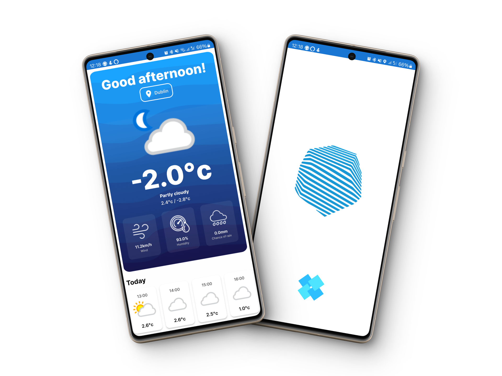

# Weather App 


## Overview

This Android app provides users with real-time weather information based on their location or a manually entered location. It utilizes the free version of the [WeatherAPI](https://www.weatherapi.com/) to fetch weather data.

## Features

- **Real-time Weather Data**: Get accurate and up-to-date weather information.
- **Location-based Forecast**: Automatically fetch weather data based on the user's location.
- **Manual Location Entry**: Allow users to input a location manually.

## Screenshots



## Prerequisites

Before you begin, ensure you have met the following requirements:

- Android Studio installed.
- Internet permission added in the `AndroidManifest.xml` file.

```xml
<uses-permission android:name="android.permission.INTERNET" />
<uses-permission android:name="android.permission.ACCESS_FINE_LOCATION" />
```

## Installation

Clone the repository and open the project in Android Studio.

```bash
git clone https://github.com/VicentCodes/ViceWeath.git
```

Add your WeatherAPI key to the `gradle.properties` file:

```properties
API_KEY=your_weather_api_key
```

## Usage

1. Run the app on an emulator or physical device.
2. Grant location permissions when prompted.
3. The app will automatically fetch weather data based on your location.
4. You can manually enter a location by long-pressing on the location card.

## Dependencies

- [Volley](https://github.com/google/volley) - For network requests.
- [Glide](https://github.com/bumptech/glide) - For image loading.

```gradle
implementation 'com.android.volley:volley:1.2.1'
implementation 'com.github.bumptech.glide:glide:4.12.0'
annotationProcessor 'com.github.bumptech.glide:compiler:4.12.0'
```

## License

This project is licensed under the MIT License - see the [LICENSE](LICENSE) file for details.

## Acknowledgments

- UI design based on the work of [Offdesignarea](https://dribbble.com/shots/15661680-Weather-App).
- Weather data provided by [WeatherAPI](https://www.weatherapi.com/).

---

Feel free to customize the readme according to your project structure and specific details. Add more sections if needed, such as contributing guidelines, code styling conventions, or troubleshooting tips.
